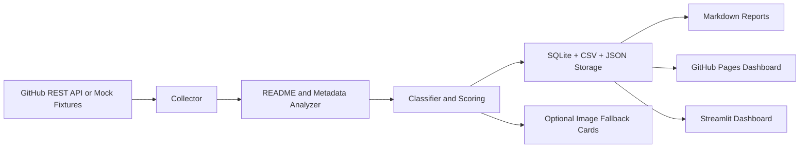

# GitHub Insight - Daily Open-Source Intelligence Radar

GitHub Insight is a portfolio-ready data automation project that discovers useful public GitHub repositories, turns noisy metadata into actionable insights, stores date-separated reports, and publishes a GitHub Pages dashboard plus a local Streamlit dashboard.

## Problem Statement

GitHub discovery is noisy. Stars alone do not explain whether a project is useful, reproducible, maintained, safe to try, or relevant to general users, data analysts, or data scientists. This project builds a repeatable intelligence pipeline that collects evidence, scores repositories transparently, and generates reports that can support learning, portfolio planning, and technical review.

## Who Benefits

- **General users**: useful tools, automation, AI utilities, self-hosted apps, and learning resources.
- **Data analysts**: SQL, dashboard, BI, ETL, reporting, data cleaning, and portfolio case-study ideas.
- **Data scientists**: ML/AI repositories, benchmarks, notebooks, datasets, reproducibility signals, and research tracking.
- **Portfolio reviewers**: a reproducible Python automation project with API ingestion, scoring, storage, dashboards, tests, and CI.

## Architecture



## Data Pipeline

1. Load audience, query, scoring, and image policy configuration from `config/`.
2. Run in either `mock` mode or `live` GitHub API mode.
3. Deduplicate repositories by `full_name` and preserve source audiences and queries.
4. Enrich repositories with README, language, release, reproducibility, and risk signals when available.
5. Generate deterministic scores for usefulness, momentum, audience fit, maintenance, README quality, reproducibility, data/demo value, and risk.
6. Persist outputs to SQLite, CSV, JSON, Markdown, and dashboard files.
7. Validate required artifacts and scan for obvious committed secret patterns.

## Scoring Methodology

The main score is clamped from 0 to 100:

```text
0.20 * usefulness_score
+ 0.20 * momentum_score
+ 0.15 * audience_fit_score
+ 0.15 * maintenance_score
+ 0.10 * readme_quality_score
+ 0.10 * reproducibility_score
+ 0.10 * data_asset_or_demo_score
- 0.15 * risk_score
```

Scores are heuristics, not definitive rankings. Risk flags include archived repos, missing license, short or missing README, unclear installation, stale code, and hype language without evidence.

## Setup on Windows

```powershell
cd "C:\Users\Admin\OneDrive\Documents\Github Insight"
python -m pip install -e ".[dev]"
python -m github_insight.cli run --mock
python -m github_insight.cli dashboard
python -m github_insight.cli validate
pytest
```

## Main Commands

```powershell
python -m github_insight.cli run --mock
python -m github_insight.cli run --date today
python -m github_insight.cli dashboard
python -m github_insight.cli weekly
python -m github_insight.cli init-db
python -m github_insight.cli validate
```

The old entry point remains available for compatibility:

```powershell
python -m scripts.github_insight --sample --date 2026-07-02
```

## Environment Variables

Copy `.env.example` to `.env` for local use. Do not commit `.env`.

| Variable | Purpose |
| --- | --- |
| `GH_PAT` | Preferred GitHub personal access token for live API mode. |
| `GITHUB_TOKEN` | Fallback GitHub token; GitHub Actions provides this automatically. |
| `OPENAI_API_KEY` | Optional future LLM/image generation key. Not required for core pipeline. |
| `ENABLE_LLM_SUMMARY` | Optional; default `false`. |
| `ENABLE_IMAGE_GENERATION` | Optional; default `false`. |
| `IMAGE_MODEL` | Default `gpt-image-2`. |
| `IMAGE_TOP_N` | Maximum project visuals when image generation is enabled. |
| `MAX_REPOS_PER_AUDIENCE` | Bounded search volume per audience. |
| `MAX_REPOS_TOTAL` | Bounded total repositories per run. |
| `MAX_DETAILS_PER_RUN` | Bounded README/language/release enrichment volume. |
| `DAYS_LOOKBACK` | Search query freshness window. |
| `GITHUB_API_VERSION` | GitHub REST API version header. |
| `TIMEZONE` | Defaults to `Asia/Kuala_Lumpur`. |

## Daily Outputs

A successful daily run generates:

- `reports/daily/YYYY-MM-DD-daily-brief.md`
- `reports/daily/YYYY-MM-DD-general-user.md`
- `reports/daily/YYYY-MM-DD-data-analyst.md`
- `reports/daily/YYYY-MM-DD-data-scientist.md`
- `reports/daily/YYYY-MM-DD-action-list.md`
- `reports/latest/latest-daily-brief.md`
- `reports/latest/latest-projects.json`
- `data/raw/YYYY-MM-DD-github-api-raw.json`
- `data/processed/YYYY-MM-DD-github-insight-projects.csv`
- `data/processed/YYYY-MM-DD-github-insight-projects.json`
- `data/processed/github_repos_master.csv`
- `data/github_insight.sqlite`
- `docs/index.html`
- `docs/data/latest.json`
- `docs/data/archive_index.json`

## Dashboards

Static GitHub Pages dashboard:

```powershell
python -m github_insight.cli dashboard
```

Open `docs/index.html` or publish the `docs/` folder with GitHub Pages.

Local Streamlit dashboard:

```powershell
streamlit run dashboard/app.py
```

The Streamlit app reads `data/processed/github_repos_master.csv`, `docs/data/latest.json`, and `docs/data/archive_index.json`.

## GitHub Actions

This repo includes:

- `.github/workflows/ci.yml` for pull request and push checks.
- `.github/workflows/daily_github_insight.yml` for scheduled/manual daily runs.

Required settings:

1. Push this project to GitHub.
2. Enable Actions with `contents: write` permission.
3. Optional: add `GH_PAT` if you want higher API limits than the default `GITHUB_TOKEN`.
4. Optional: add `OPENAI_API_KEY` only if enabling future LLM/image generation.
5. Enable GitHub Pages from the `docs/` folder on the default branch.

## Image Generation Option

Image generation is disabled by default. If `ENABLE_IMAGE_GENERATION=true`, the current implementation creates deterministic fallback PNG cards and metadata JSON when no API key is available. This keeps the core pipeline free and reliable. The metadata schema records date, repo, model, prompt, source facts, alt text, generated timestamp, status, asset path, and errors.

## Testing

```powershell
pytest
```

Tests run offline and cover CLI mock generation, scoring/classification, SQLite storage, report writing, dashboard rebuild, validation, and image fallback.

## Security and Secrets Handling

- `.env` is ignored.
- Tokens are read from environment variables only.
- Authorization headers are not printed.
- Validation scans generated text files for obvious token patterns.
- The MVP does not clone repositories, execute external code, or scrape arbitrary pages.

## Limitations

- GitHub Search API is near-real-time and rate-limited, not a complete real-time feed.
- Momentum is approximate until multiple daily snapshots exist.
- README analysis is heuristic and cautious.
- Optional OpenAI-powered wording or imagery may cost money and is not required.
- Scores are an intelligence aid, not a definitive quality ranking.

## Roadmap

- Add richer historical delta calculations from SQLite snapshots.
- Add stronger README and file-tree enrichment through bounded GitHub API calls.
- Add optional validated LLM summaries using source-fact JSON.
- Add richer trend charts in Streamlit and GitHub Pages.
- Add DOCX export if needed for reporting workflows.

## Resume Bullets

- Built an automated GitHub intelligence pipeline using Python, GitHub REST API, SQLite, CSV/JSON reporting, and GitHub Actions.
- Designed explainable scoring for usefulness, momentum, data analyst relevance, data scientist relevance, reproducibility, and maintenance risk.
- Generated daily Markdown reports and a GitHub Pages dashboard with archive ordering by `generated_at`.
- Added optional GPT Image 2-ready editorial visuals with deterministic fallback cards and metadata tracking.
- Implemented CI tests, mock mode, rate-limit-aware API client, and portfolio-ready documentation.
