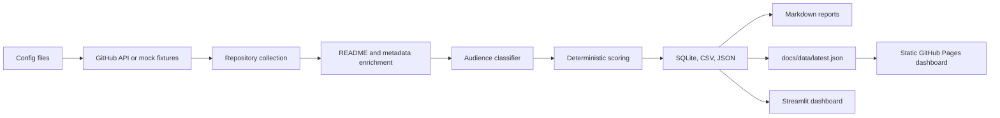

# GitHub Insight - Daily Open-Source Intelligence Radar

GitHub Insight is a portfolio-ready Python automation system that collects useful public GitHub repositories, scores them for practical audiences, stores date-separated outputs, and publishes a static GitHub Pages dashboard.

- Live dashboard: https://leombe.github.io/github-insight-radar/
- Source repository: https://github.com/LeombE/github-insight-radar
- Primary CLI: `python -m github_insight.cli`
- Default mock behavior: safe offline preview under `.pytest-tmp/mock-run`, not production docs

## Problem Statement

GitHub discovery is noisy. Stars alone do not show whether a project is useful, actively maintained, reproducible, safe to try, or relevant to a learner, analyst, scientist, or portfolio reviewer. GitHub Insight turns repository metadata and bounded README evidence into a daily intelligence product with transparent scoring, risk notes, recommended actions, and repeatable outputs.

The goal is not to declare a universal best repository. The goal is to help users decide what to try today, save for later, study for a role, or skip because the available evidence is weak.

## Who Benefits

- General users looking for practical tools, automation, AI utilities, templates, and self-hosted apps.
- Data analysts looking for SQL, BI, dashboard, reporting, ETL, data-cleaning, and portfolio case-study ideas.
- Data scientists looking for ML, AI, benchmark, dataset, notebook, reproducibility, and evaluation ideas.
- Recruiters and reviewers evaluating an end-to-end data automation project with API ingestion, scoring, storage, dashboards, tests, and CI.

## Key Features

- Official GitHub API collection for live mode; deterministic fixture collection for offline mock mode.
- Strict mock/live separation so mock runs do not overwrite production GitHub Pages data by default.
- Audience classification for `general_user`, `data_analyst`, and `data_scientist`.
- Explainable 0-100 scoring with usefulness, momentum, audience fit, maintenance, README quality, reproducibility, data/demo signals, and risk penalty.
- Low, Medium, and High risk severity labels plus High, Medium, and Low confidence labels.
- Static GitHub Pages dashboard with stakeholder views, Today's Picks, Top 20 / Top 50 / Top 100 / All display control, filters, search, live/mock badges, scorecards, and live-only archive display by default.
- Local Streamlit dashboard for exploratory review.
- Date-separated Markdown, CSV, JSON, SQLite, and dashboard outputs.
- GitHub Actions automation for testing, daily live collection, dashboard rebuild, validation, and committing generated live outputs.
- Optional image-generation structure with deterministic fallback cards; image generation remains disabled by default.

## Data Pipeline



Pipeline stages:

1. Load audience, query, scoring, and image policy configuration from `config/`.
2. Run in either fully offline `mock` mode or live GitHub API mode.
3. Deduplicate repositories by `full_name` while preserving source audiences and queries.
4. Enrich repositories with bounded metadata and README-derived signals when available.
5. Classify audience fit and calculate deterministic scores.
6. Write raw, processed, report, dashboard, archive, and SQLite outputs.
7. Validate required artifacts and scan generated text for obvious secret patterns.

## Scoring Methodology

The canonical daily pipeline scores each repository from 0 to 100. The formula is implemented in `github_insight/classifier.py`:

```text
0.20 * usefulness_score
+ 0.20 * momentum_score
+ 0.15 * audience_fit_score
+ 0.15 * maintenance_score
+ 0.10 * readme_quality_score
+ 0.10 * reproducibility_score
+ 0.10 * data_asset_score
- 0.15 * risk_score
```

Recommended actions are deterministic:

| Overall score / condition | Recommended action |
| --- | --- |
| Archived or disabled | Skip for now |
| 80+ | Try today |
| 70-79.99 | Use as portfolio reference |
| 60-69.99 | Study for learning |
| Data scientist repository and 45-59.99 | Track for research |
| 45-59.99 | Watch this week |
| Below 45 | Skip for now |

Scores are heuristics and should be read with the evidence and caveats shown on each card. More detail is documented in [docs/scoring-methodology.md](docs/scoring-methodology.md).

## Risk and Confidence

Risk is calculated from deterministic flags such as archived status, disabled status, missing license, stale pushes, many open issues relative to stars, fork-only status, and README/enrichment caveats. The dashboard groups risk as:

| Risk score | Dashboard severity |
| ---: | --- |
| 0-29.99 | Low |
| 30-59.99 | Medium |
| 60+ | High |

Confidence describes how much supporting evidence was available:

| Confidence | Meaning |
| --- | --- |
| High | README quality is strong and the project has no more than two risk flags. |
| Medium | README and description evidence exist, but the evidence is not strong enough for High. |
| Low | Key supporting evidence is missing or weak. |

## Output Contract

A successful production live run writes date-separated outputs such as:

- `reports/daily/YYYY-MM-DD-daily-brief.md`
- `reports/daily/YYYY-MM-DD-general-user.md`
- `reports/daily/YYYY-MM-DD-data-analyst.md`
- `reports/daily/YYYY-MM-DD-data-scientist.md`
- `reports/daily/YYYY-MM-DD-action-list.md`
- `reports/latest/latest-daily-brief.md`
- `reports/latest/latest-projects.json`
- `data/raw/YYYY-MM-DD-github-api-raw.json`
- `data/processed/YYYY-MM-DD-github-insight-projects.csv`
- `data/processed/YYYY-MM-DD-github-insight-projects.json`
- `data/processed/github_repos_master.csv`
- `data/github_insight.sqlite`
- `docs/index.html`
- `docs/data/latest.json`
- `docs/data/archive_index.json`

Mock runs write to an isolated preview root by default and do not publish to production `docs/` unless explicitly allowed.

## Local Setup

```powershell
cd "C:\Users\Admin\OneDrive\Documents\Github Insight"
python -m pip install -e ".[dev]"
python -m github_insight.cli run --mock
python -m github_insight.cli --output-root .pytest-tmp/mock-run dashboard
python -m github_insight.cli --output-root .pytest-tmp/mock-run validate
python -m pytest
```

For a local live run:

```powershell
$env:GH_PAT="your_github_token"
python -m github_insight.cli run --date today
python -m github_insight.cli dashboard
python -m github_insight.cli validate
```

`GH_PAT` is optional but recommended for live mode because unauthenticated GitHub API limits are low. Never commit `.env`, tokens, credentials, cookies, or raw private data.

## Main Commands

```powershell
python -m github_insight.cli run --mock
python -m github_insight.cli run --date today
python -m github_insight.cli dashboard
python -m github_insight.cli weekly
python -m github_insight.cli init-db
python -m github_insight.cli validate
```

Compatibility entry point:

```powershell
python -m scripts.github_insight --sample --date 2026-07-02
```

## Dashboard Stakeholder Views

The static dashboard includes a `Stakeholder View` selector with `Overview` as the default. Users can switch to General User, Data Analyst, Data Scientist, or Portfolio Reviewer / Recruiter views without changing the underlying scoring model. `Today's Picks` highlights a short set of projects for the selected stakeholder view, while the existing search, filters, risk controls, and Top 20 / 50 / 100 / All display selector continue to work on the same project data.

## Dashboards

Static GitHub Pages dashboard:

```powershell
python -m github_insight.cli dashboard
```

The static dashboard is fully self-contained in `docs/index.html` and reads embedded JSON generated from `docs/data/latest.json`.

Local Streamlit dashboard:

```powershell
streamlit run dashboard/app.py
```

The Streamlit app reads local processed data and dashboard JSON files for interactive review.

## GitHub Actions Automation

This repository includes:

- `.github/workflows/ci.yml` for test and lint checks.
- `.github/workflows/daily_github_insight.yml` for scheduled/manual daily runs.

The daily workflow:

1. Installs the package with development dependencies.
2. Runs `python -m pytest`.
3. Runs the live daily pipeline by default.
4. Rebuilds the static dashboard.
5. Runs validation.
6. Commits generated live outputs only when files changed.

Manual `mock_mode=true` runs are isolated under `.pytest-tmp/mock-run` and skip production commits.

Required repository settings:

1. Enable GitHub Actions.
2. Allow workflow `contents: write` permission for committing generated live outputs.
3. Add optional `GH_PAT` as a repository secret for higher GitHub API limits.
4. Keep `ENABLE_IMAGE_GENERATION=false` unless intentionally testing optional image output.
5. Publish GitHub Pages from the `docs/` folder on the default branch.

## Environment Variables

| Variable | Purpose |
| --- | --- |
| `GH_PAT` | Preferred token for live GitHub API mode. |
| `GITHUB_TOKEN` | Fallback token; GitHub Actions provides this automatically. |
| `ALLOW_MOCK_PUBLISH` | Allows mock data to write production docs only when set intentionally. Default `false`. |
| `FAIL_ON_MOCK_PRODUCTION` | Makes validation fail if production `docs/data/latest.json` contains mock data. |
| `ENABLE_IMAGE_GENERATION` | Optional image path. Default `false`. |
| `IMAGE_MODEL` | Image model name used in metadata when image generation is enabled. Default `gpt-image-2`. |
| `IMAGE_TOP_N` | Maximum project visuals when optional image output is enabled. |
| `MAX_REPOS_PER_AUDIENCE` | Bounded GitHub search volume per audience. |
| `MAX_REPOS_TOTAL` | Bounded total repositories per run. |
| `MAX_DETAILS_PER_RUN` | Bounded enrichment volume. |
| `DAYS_LOOKBACK` | Query freshness window. |
| `GITHUB_API_VERSION` | GitHub REST API version header. |
| `TIMEZONE` | Defaults to `Asia/Kuala_Lumpur`. |

## Security and Data Boundaries

- Uses official GitHub APIs for live collection.
- Does not scrape GitHub HTML by default.
- Does not clone arbitrary repositories.
- Does not execute external repository code.
- Does not print authorization headers.
- Keeps mock and live modes separate.
- Treats missing evidence as unavailable instead of inventing facts.
- Keeps generated archives date-separated and ordered by `generated_at`.

## Limitations

- GitHub Search API is rate-limited and not a complete real-time feed.
- Scores are heuristic and depend on available metadata and bounded README evidence.
- README quality, installation reliability, and feature completeness are not fully verified.
- Momentum becomes more meaningful after multiple live snapshots exist.
- Risk and confidence labels are evidence aids, not security audits.
- Optional image generation is disabled by default and is not needed for the core portfolio project.

## Roadmap

- Add richer historical deltas from SQLite snapshots.
- Add trend charts for score movement, stars, forks, risk, and audience mix.
- Add stronger bounded README/file-tree enrichment through GitHub API calls.
- Add optional source-grounded LLM summaries with strict fact constraints.
- Add DOCX or PDF export for portfolio/reporting workflows.
- Add more dashboard explainability for score components and risk drivers.

## Resume Bullets

- Built an automated GitHub intelligence radar using Python, GitHub REST API, SQLite, CSV/JSON outputs, Markdown reports, GitHub Pages, and GitHub Actions.
- Designed deterministic audience classification and explainable scoring for general users, data analysts, and data scientists.
- Implemented mock/live production safety guards so offline demos cannot overwrite the live GitHub Pages dashboard by default.
- Published a static dashboard with search, filters, Top 20/50/100/All display control, risk severity, confidence labels, and live-only archive defaults.
- Added validation, pytest coverage, ruff linting, secret-pattern checks, and clear portfolio documentation for reproducible review.
